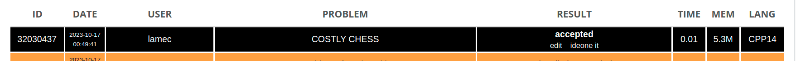
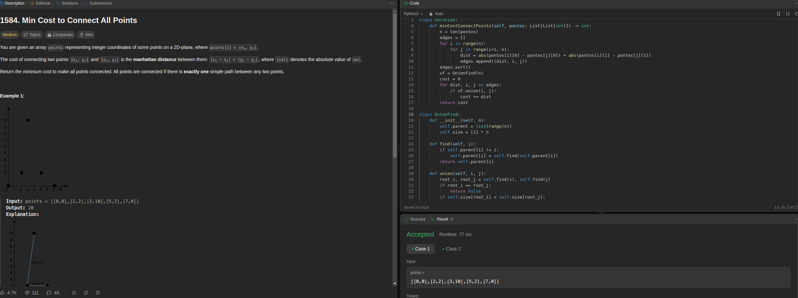
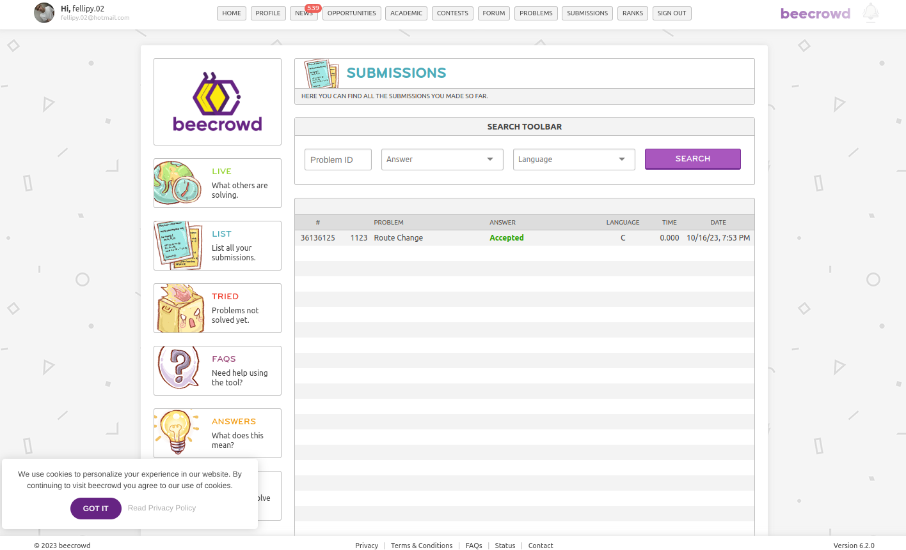

# Exercícios Resolvidos

**Conteúdo da Disciplina**: Grafos 2

## Alunos

|Matrícula | Aluno |
| -- | -- |
| 20/0017772  |  Fellipe Pereira da Costa Silva |
| 18/0104390  |  Lameque Fernandes de Azevedo |

## Sobre 

O repositório contém soluções para algumas questões de juíz online. Segue a lista dos exercicios escolhidos:

- CCHESS, COSTLY CHESS (https://www.spoj.com/problems/CCHESS/)
- Desvio de Rota - (https://www.beecrowd.com.br/judge/pt/problems/view/1123)
- Min Cost to Connect All Points
 (https://leetcode.com/problems/min-cost-to-connect-all-points/description/)


## Screenshots

- CCHESS, COSTLY CHESS


- Min Cost to Connect All Points


- Desvio de Rota 



## Instalação 
Para executar as questões deste repositório, é necessário ter um compilador de C, C++ instalado. E um interpretador python3.

## Uso 
Para rodar as questões presentes neste repositório, é recomendado utilizar o compilador g++ para as questões realizadas em C++, gcc para questões implementadas em C e um interpretador python para rodar as questões realizadas em python.

Passo a passo:
1. Clone o repositório utilizando o seguinte comando: ```git clone https://github.com/projeto-de-algoritmos/Grafos1_ExerciciosJuizOnline```
2. Entre na pasta da questão que deseja executar: ```cd <pasta_da_questao>```
3. Rodar questão: 
    - Caso a questão tenha sido implementada em C++, compile a questão com o seguinte comando: ```g++ -o <nome_desejado_para_o_executavel> <nome_da_questao.cpp>``` e execute o arquivo executável gerado: ```./<nome_do_arquivo_executavel>```.
    - Caso a questão tenha sido implementada em C, compile a questão com o seguinte comando: ```gcc -o <nome_desejado_para_o_executavel> <nome_da_questao.cpp>``` e execute o arquivo executável gerado: ```./<nome_do_arquivo_executavel>```.
    - Caso a questão tenha sido implementada em python3, execute o arquivo executável: ```python3 <nome_do_arquivo_executavel>```.

*OBS*: Caso queira executar a questão com uma das entradas de exemplo fornecidas, utilize o seguinte comando: ```./<nome_do_arquivo_executavel> < in.txt``` 
Dessa forma, será possível testar a questão com os exemplos de entrada fornecidos.

## Apresentação

Assista o vídeo explicativo do projeto clicando [aqui](assets/apresentacao.mp4).

Observação: A apresentação está em formato .mp4, portanto, faça o download para assisti-la.